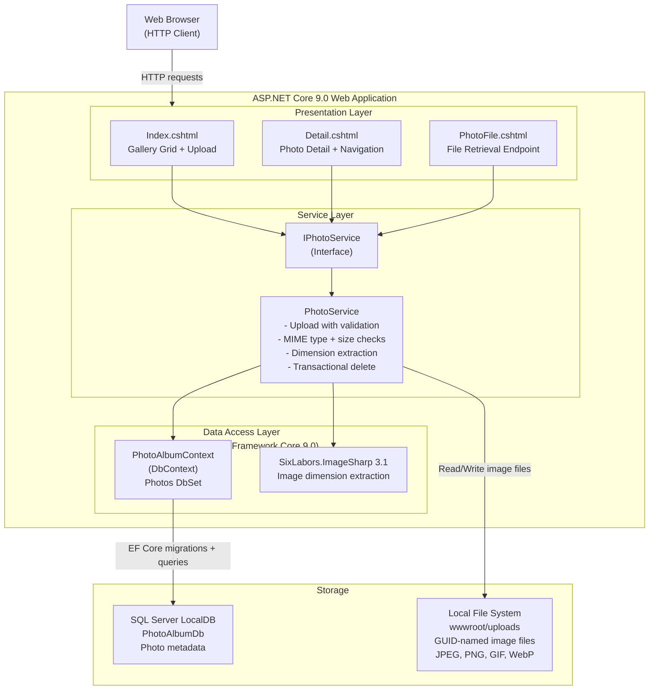

# Architecture Diagram

PhotoAlbum is an ASP.NET Core 9.0 Razor Pages web application for photo gallery management, using local file storage and SQL Server for persistence.

## Application Architecture

