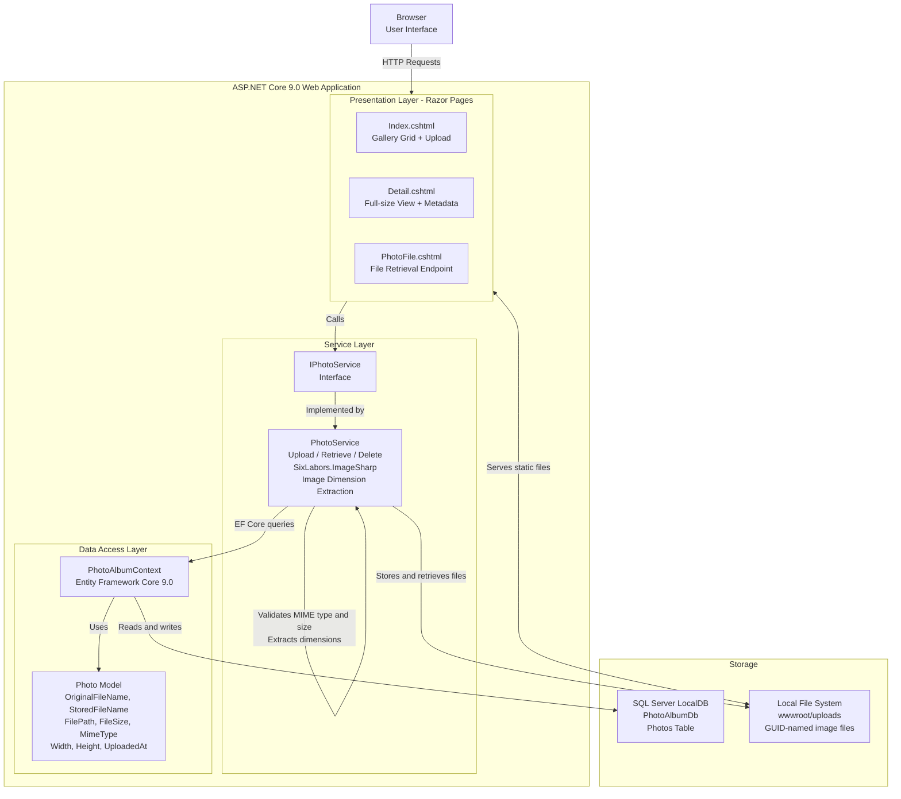

# Architecture Diagram

PhotoAlbum is an ASP.NET Core 9.0 Razor Pages web application for photo gallery management with local file storage and SQL Server database persistence.

## Application Architecture

