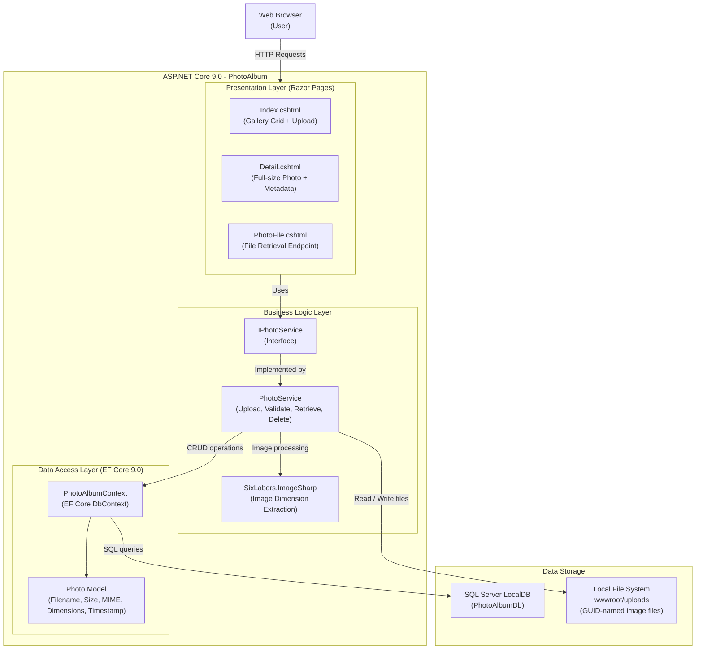

# PhotoAlbum Application Architecture Diagram

## Architecture Overview

| Layer | Technology | Responsibility |
|-------|-----------|----------------|
| Presentation | ASP.NET Core Razor Pages | Gallery UI, upload form, photo display |
| Business Logic | PhotoService (C#) | File validation, upload, retrieval, deletion |
| Image Processing | SixLabors.ImageSharp 3.1 | Extract image dimensions from uploaded files |
| Data Access | EF Core 9.0 + SQL Server | Persist photo metadata with descending timestamp index |
| File Storage | Local file system (`wwwroot/uploads`) | Store GUID-named image files |
| Database | SQL Server LocalDB | Persist photo records |

## Key Design Notes

- **Service abstraction**: `IPhotoService` interface enables future swap to Azure Blob Storage
- **Transactional consistency**: File is deleted on DB save failure to avoid orphaned files
- **Configuration-driven**: File size limits (10 MB) and allowed MIME types in `appsettings.json`
- **Auto-migrations**: EF Core migrations applied automatically on startup (skipped in test environment)
